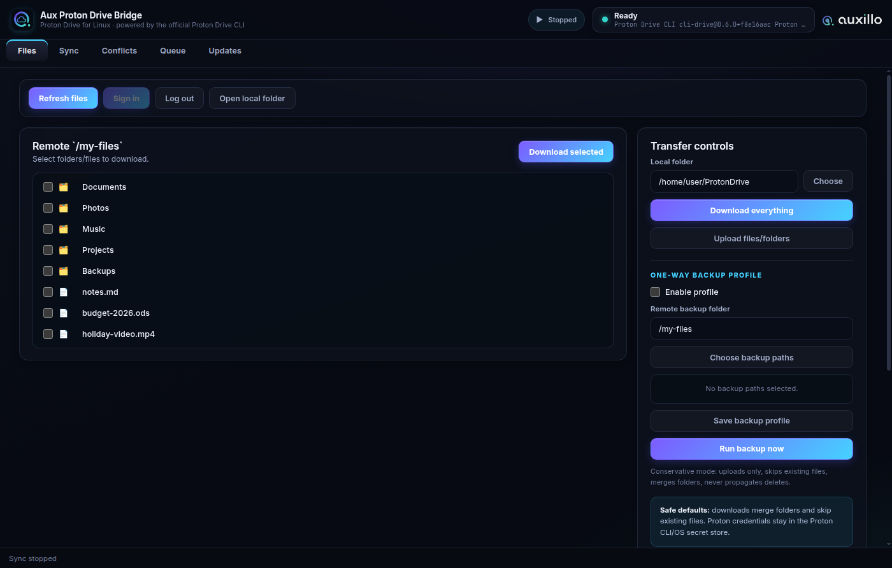

🌐 [English](README.md) · [Deutsch](README.de.md) · [简体中文](README.zh.md) · **Italiano** · [Español](README.es.md) · [Français](README.fr.md) · [日本語](README.ja.md) · [Português](README.pt.md) · [Русский](README.ru.md)

---

# Aux Proton Drive Bridge

**Il client desktop di Proton Drive che manca a Linux.** Sfoglia, carica, scarica e sincronizza il tuo Proton Drive — con sincronizzazione unidirezionale e bidirezionale, sincronizzazione selettiva, gestione dei conflitti, coda dei trasferimenti e release firmate. Costruito sul CLI ufficiale `proton-drive` di Proton: le tue credenziali non lasciano mai gli strumenti di Proton.

> Progetto comunitario non ufficiale. Non affiliato, approvato o sponsorizzato da Proton AG.



## Perché esiste

Proton non offre un client desktop di Proton Drive per Linux. Il CLI ufficiale fa il lavoro pesante, ma vive nel terminale. Aux Proton Drive Bridge avvolge quel CLI in una vera applicazione desktop — autenticazione e cifratura restano interamente nel client di Proton.

## Funzionalità

- **Sfogliare e trasferire** — elencare `/my-files`, scaricare gli elementi selezionati o tutto, caricare file e cartelle
- **Motore di sincronizzazione in background** — quattro modalità: conservativa (solo caricamento, salta gli esistenti), caricamento unidirezionale, download unidirezionale e bidirezionale completa
- **Sincronizzazione selettiva** — i pattern di esclusione valgono in entrambe le direzioni: gli elementi esclusi non vengono né caricati né scaricati
- **Rilevamento e revisione dei conflitti** — modifiche su entrambi i lati, eliminazione-contro-modifica, conflitti di tipo e di hash, con strategie sicure; la sincronizzazione non propaga mai le eliminazioni
- **Coda dei trasferimenti** — trasferimenti concorrenti con priorità, pausa/ripresa, annullamento e cronologia persistente
- **Profili di backup unidirezionale** — backup pianificati di cartelle con semantica conservativa
- **Integrazione desktop** — vassoio di sistema, menu contestuali dei file manager (Nautilus, Dolphin, Thunar), metadati AppStream per GNOME Software / KDE Discover
- **Release firmate e aggiornamenti integrati** — checksum SHA-256 firmati con una chiave Ed25519 fissa

## Installazione

Ultima versione: **<https://github.com/Auxillo-Tech/Aux-Proton-Drive-Bridge/releases/latest>**

- **AppImage** per qualsiasi Linux x86_64 — rendere eseguibile e avviare
- **`.deb`** per Debian / Ubuntu / Mint / Pop!_OS — `sudo apt install ./<file>.deb`
- **`.rpm`** per Fedora / RHEL / openSUSE — `sudo dnf install ./<file>.rpm`
- **Tarball AUR** per Arch (PKGBUILD incluso)

Verifica il download:

```bash
sha256sum -c SHA256SUMS.txt --ignore-missing
```

`SHA256SUMS.txt.sig` è una firma Ed25519 di `SHA256SUMS.txt` (impronta `2148f39cd1004977cfde1d0a4be7b4fa`, chiave pubblica in `release-manifest.json`).

## Requisiti

- Linux x86_64
- Proton Drive CLI disponibile come `proton-drive`
- Un account Proton e un browser per l'accesso Proton
- Un portachiavi supportato dal CLI (KWallet, GNOME Keyring/libsecret o `pass`)

## Avvio rapido

1. Installa il Proton Drive CLI e verifica che `proton-drive version` funzioni.
2. Avvia Aux Proton Drive Bridge e premi **Sign in** — l'accesso si completa nel browser.
3. Premi **Refresh files**, seleziona gli elementi, scegli una cartella locale, scarica o carica.
4. Apri la scheda **Sync** per avviare la sincronizzazione nella modalità desiderata.
5. Controlla ciò che viene segnalato nella scheda **Conflicts**.

Impostazioni sicure: i download uniscono le cartelle e saltano i file esistenti; la sincronizzazione non elimina mai nulla da nessuna parte.

## Documentazione (in inglese)

- [`docs/INSTALL.md`](docs/INSTALL.md) — installazione per famiglia di distribuzione
- [`docs/USAGE.md`](docs/USAGE.md) — accesso, trasferimenti, modalità di sincronizzazione
- [`docs/TROUBLESHOOTING.md`](docs/TROUBLESHOOTING.md) — problemi comuni Linux/CLI/portachiavi
- [`docs/SECURITY.md`](docs/SECURITY.md) — gestione delle credenziali e modello di sicurezza

## Sostegno

Aux Proton Drive Bridge è libero e open source (MIT). Se ti è utile, puoi [offrirmi un caffè](https://www.buymeacoffee.com/auxillo) ☕
