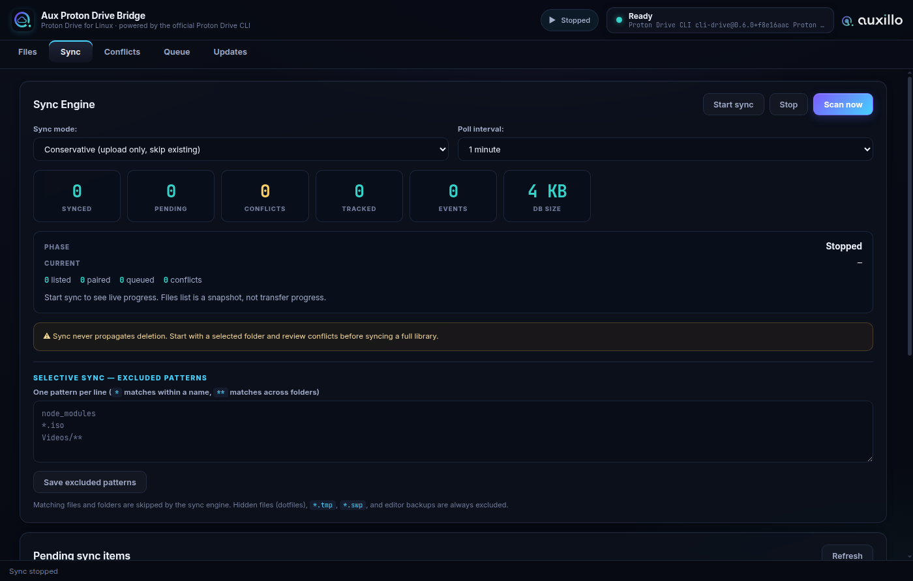
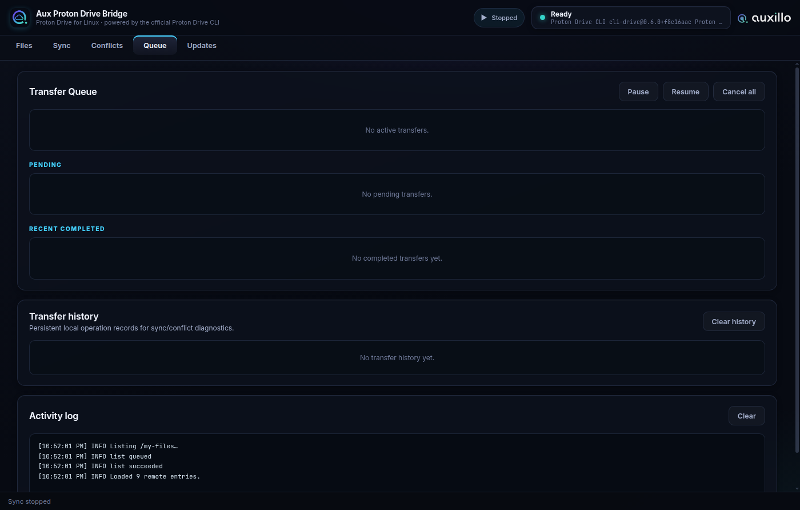

🌐 **English** · [Deutsch](README.de.md) · [简体中文](README.zh.md) · [Italiano](README.it.md) · [Español](README.es.md) · [Français](README.fr.md) · [日本語](README.ja.md) · [Português](README.pt.md) · [Русский](README.ru.md)

# Aux Proton Drive Bridge

[](https://github.com/Auxillo-Tech/Aux-Proton-Drive-Bridge/actions/workflows/ci.yml)
[](https://github.com/Auxillo-Tech/Aux-Proton-Drive-Bridge/releases/latest)
[](https://github.com/Auxillo-Tech/Aux-Proton-Drive-Bridge/releases)
[](LICENSE)
[](#requirements)
[](https://www.buymeacoffee.com/auxillo)

**The Proton Drive desktop client Linux is missing.** Browse, upload, download, and sync your Proton Drive — with one-way and bidirectional sync, selective sync, conflict handling, a transfer queue, and signed releases. Built on Proton's official `proton-drive` CLI, so your credentials never leave Proton's own tooling.

> Unofficial community project. Not affiliated with, endorsed by, or sponsored by Proton AG.


## Why this exists

Proton does not ship a Linux desktop client for Proton Drive. Their official CLI does the heavy lifting but lives in a terminal. Aux Proton Drive Bridge wraps that CLI in a full desktop app: background sync, a live queue, conflict review, tray operation, and an updater — while authentication and encryption stay entirely with Proton's own client.

## Features

- **Browse and transfer** — list `/my-files`, download selected items or everything, upload files and folders
- **Background sync engine** — four modes: conservative (upload-only, skip existing), one-way upload, one-way download, and full bidirectional
- **Selective sync** — exclude patterns fence both directions: excluded items are neither uploaded nor downloaded, and excluded remote folders are not even traversed
- **Conflict detection & review** — modified-both-sides, delete-vs-modify, type and hash mismatches, each with safe resolution strategies; sync never propagates deletions
- **Transfer queue** — concurrent transfers with priority, pause/resume, cancel, retry, and persistent history
- **One-way backup profiles** — scheduled folder backups with conservative semantics
- **Desktop integration** — system tray, close-to-tray, file-manager context menus (Nautilus, Dolphin, Thunar), AppStream metadata for GNOME Software / KDE Discover
- **Signed releases & in-app updater** — every release ships SHA-256 checksums signed with a pinned Ed25519 key; the updater picks the package format matching your install

<p>
  
  
</p>

## Install

Grab the latest release: **<https://github.com/Auxillo-Tech/Aux-Proton-Drive-Bridge/releases/latest>**

| Distro family | Asset | Install |
|---|---|---|
| Any Linux x86_64 | `Aux.Proton.Drive.Bridge-<version>-x86_64.AppImage` | make executable, run |
| Debian / Ubuntu / Mint / Pop!_OS | `Aux.Proton.Drive.Bridge-<version>-amd64.deb` | `sudo apt install ./<file>.deb` |
| Fedora / RHEL / openSUSE | `Aux.Proton.Drive.Bridge-<version>-x86_64.rpm` | `sudo dnf install ./<file>.rpm` |
| Arch (manual) | `aux-proton-drive-bridge-<version>-aur.tar.gz` | PKGBUILD included |

Full instructions per distro: [`docs/INSTALL.md`](docs/INSTALL.md)

### Verify your download

```bash
sha256sum -c SHA256SUMS.txt --ignore-missing
```

`SHA256SUMS.txt.sig` is an Ed25519 signature over `SHA256SUMS.txt` made with the project's pinned release key (fingerprint `2148f39cd1004977cfde1d0a4be7b4fa`; the full public key is in `release-manifest.json`).

## Requirements

- Linux x86_64
- [Proton Drive CLI](https://proton.me/support/drive-cli) available as `proton-drive`
- A Proton account and a browser for Proton's login flow
- A secret store supported by the Proton CLI (KWallet, GNOME Keyring/libsecret, or `pass`)

The CLI owns authentication; the bridge supports one active Proton session at a time.

## Quick start

1. Install the Proton Drive CLI and confirm `proton-drive version` works.
2. Launch Aux Proton Drive Bridge and click **Sign in** — the login completes in your browser.
3. Click **Refresh files**, select items, pick a local folder, and download or upload.
4. Open the **Sync** tab to start background sync in the mode you want.
5. Review anything flagged in the **Conflicts** tab.

Safe defaults: downloads merge folders and skip existing files; sync never deletes anything on either side. Full guide: [`docs/USAGE.md`](docs/USAGE.md)

## Documentation

- [`docs/INSTALL.md`](docs/INSTALL.md) — install instructions by distro family
- [`docs/USAGE.md`](docs/USAGE.md) — sign-in, transfers, sync modes, workflows
- [`docs/TROUBLESHOOTING.md`](docs/TROUBLESHOOTING.md) — common Linux/CLI/keyring problems
- [`docs/SECURITY.md`](docs/SECURITY.md) — credential handling and app security model
- [`CHANGELOG.md`](CHANGELOG.md) — release history

## Build from source

```bash
npm ci
npm run check        # unit tests + static checks
npm start            # run from source
npm run dist:linux   # build AppImage, .deb, .rpm into dist/
```

## Security model

- The app never asks for or sees your Proton password; login happens in Proton's own CLI/browser flow.
- Renderer runs with `nodeIntegration` disabled and context isolation enabled; CLI calls are argv arrays, never shell strings.
- Credentials and tokens are redacted from logs and stored history.

Details: [`docs/SECURITY.md`](docs/SECURITY.md) · Vulnerability reports: [`SECURITY.md`](SECURITY.md)

## Roadmap

- AUR, Flathub, and Snap distribution
- Desktop notifications for all sync events
- Content-diff conflict viewer
- Multi-account support

## Support

Aux Proton Drive Bridge is free and open source (MIT). If it helps your workflow, you can [buy me a coffee](https://www.buymeacoffee.com/auxillo) ☕
